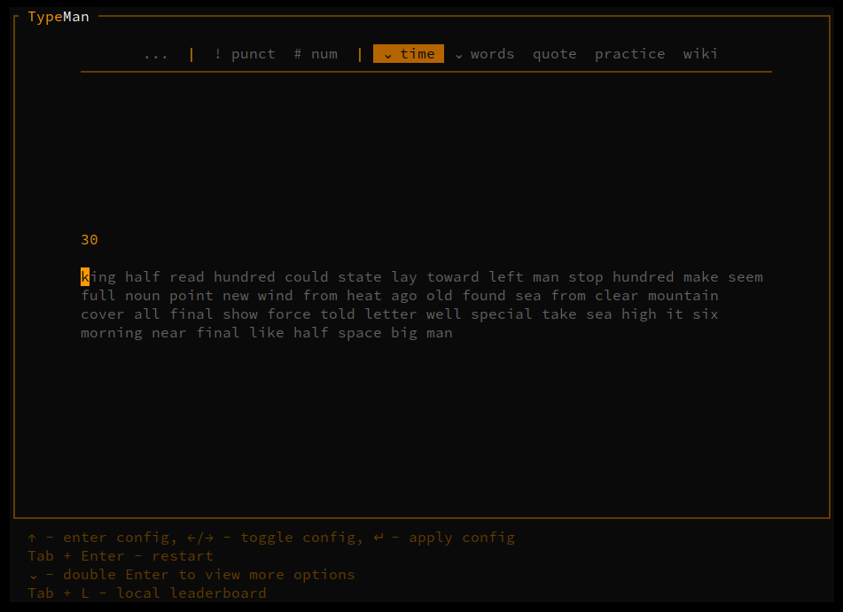
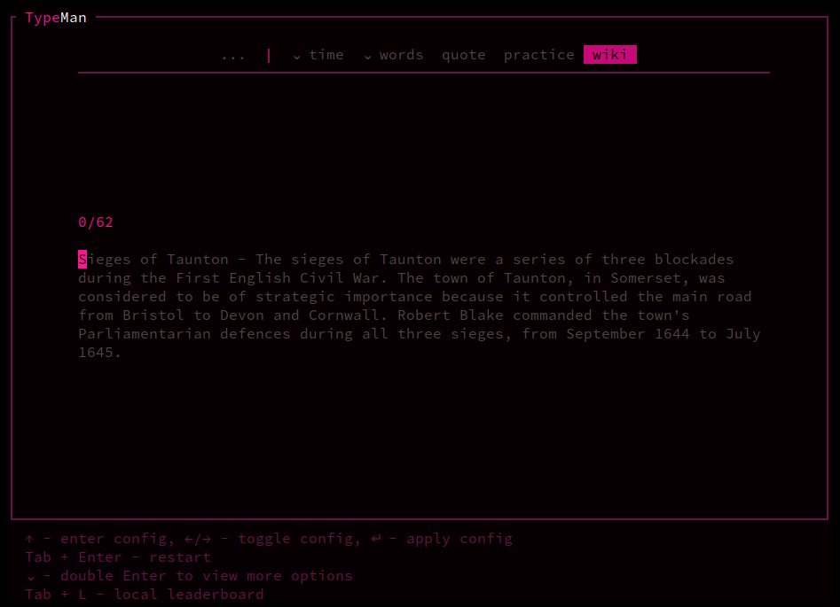
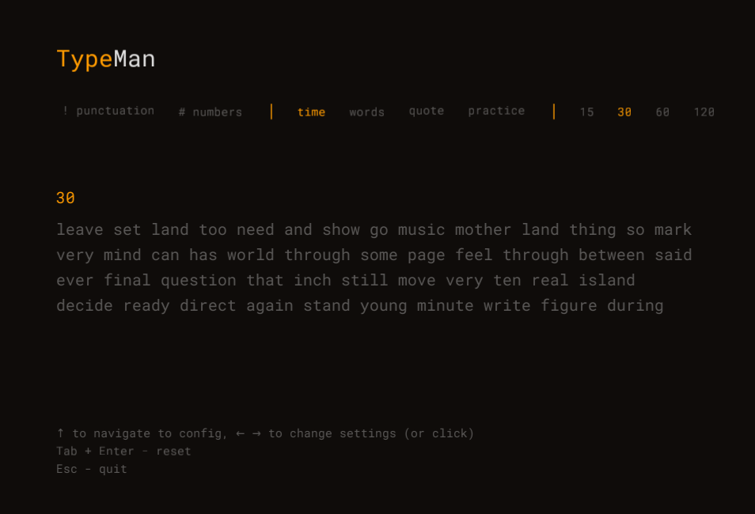
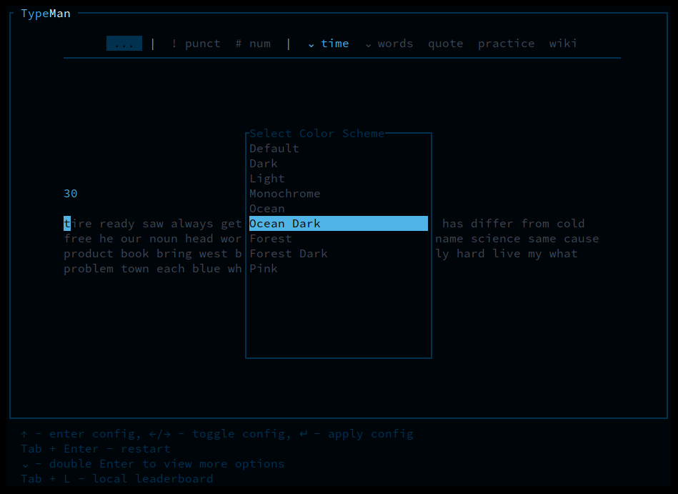
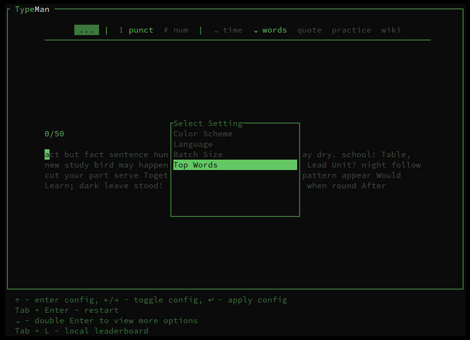

# TypeMan
Typing speed test with practice mode in GUI, TUI and CLI

 

 

 

 

 
  

## Installation

### Crates.io:
    cargo install typeman

--- 
### Common problems:
##### On MacOS:
    cargo install --target x86_64-apple-darwin typeman
##### On Ubuntu (before installing):
    sudo apt-get install libfontconfig1-dev
    sudo apt install libasound2-dev

---

### From source:
#### 1. clone repo  
    git clone https://github.com/mzums/typeman      
#### 2. enter project
    cd typeman
#### 3. run
    cargo run

## Modes:
- **TUI** (ratatui)
- **GUI** (macroquad)
- **CLI**

## CLI parameters:
- **word number**: number of displayed words
- **top words**: number of top most common english words used to generae test
- **time**: duration of the test in time mode
- **quote**: random quote
- **punctuation**: punctuation in word number and time modes
- **digits**: digits  in word and time modes
- **level** - practice level

## Commands:
- `typeman` - TUI
- `typeman --gui` - GUI
- `typeman --cli` - CLI
    - `typeman --cli -c ./text.txt` - custom file
    - `typeman --cli -q` - random quote
    - `typeman --cli (-t=30) -n=500` - 30s (default) test with random words from 500 most used english words
    - `typeman --cli -w=50 -n=500 -p -d` - 50 random words from 500 most used english words with punctuation and digits
    - `typeman --cli -l` - list all practice levels
    - `typeman --cli -l=1` - practice first level

---

### Credits:
- https://github.com/dwyl/quotes  
- https://github.com/JackShannon/1000-most-common-words/blob/master/1000-common-english-words.txt
- https://fonts.google.com/specimen/Roboto+Mono?preview.text=Whereas%20recognition%20of%20the%20inherent%20dignity

### Special thanks to [piter231](https://github.com/piter231/) for testing!